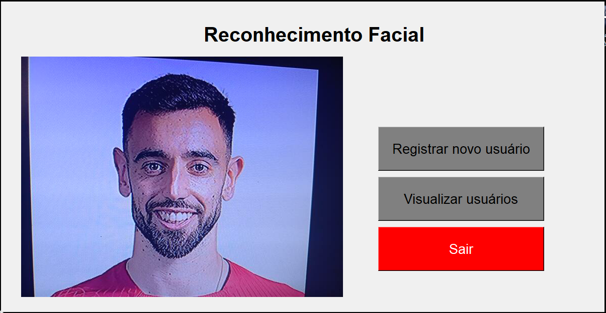
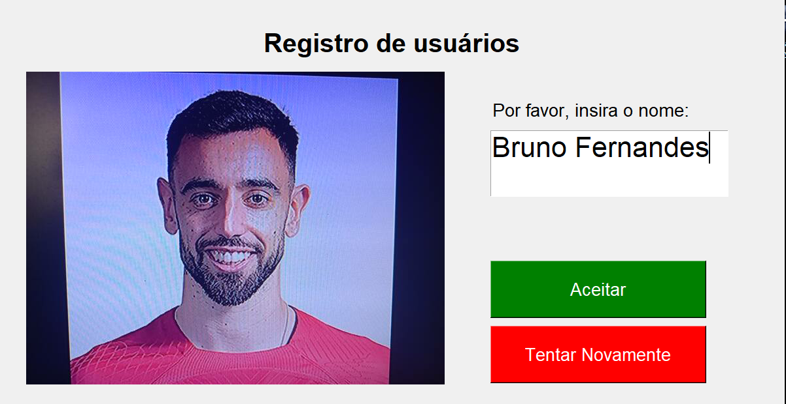
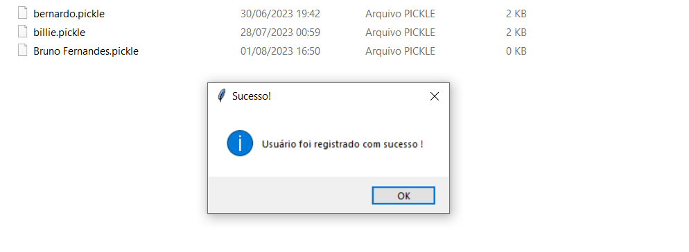
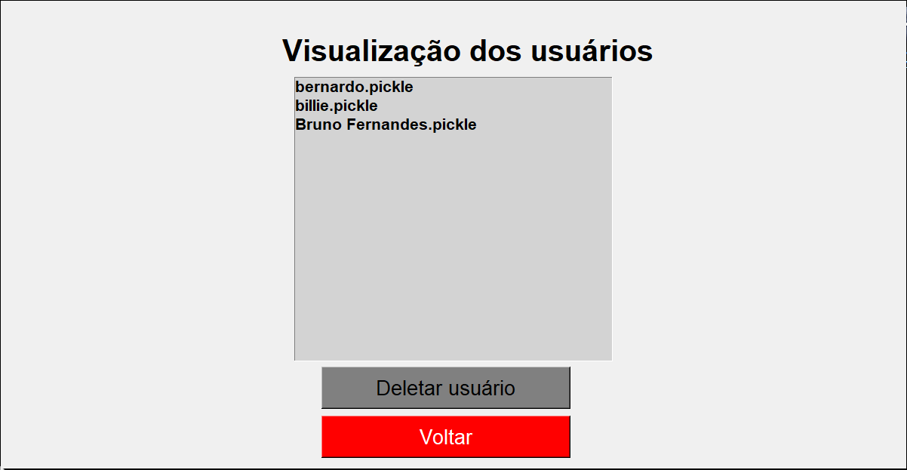
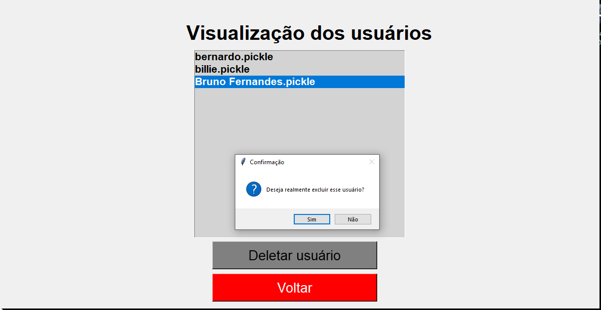
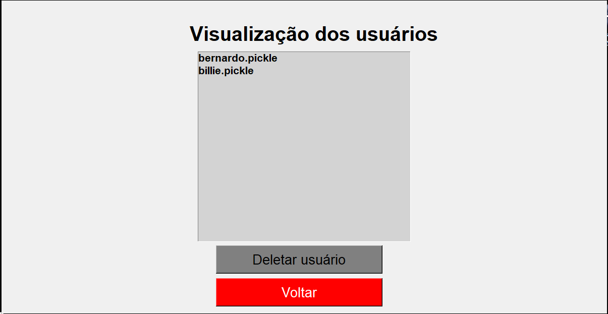
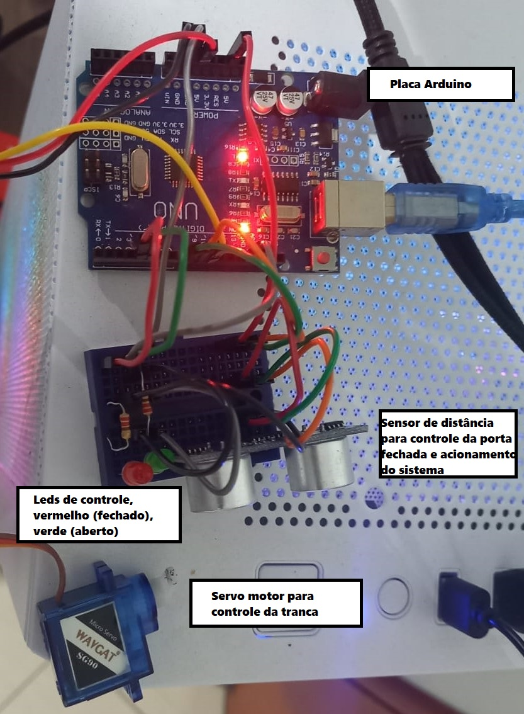

# Projeto final - Laboratório de Inovação e Automação I
### Sistema de entrada/tranca com reconhecimento facial
---
* Para o uso dos componentes integrados ao arduíno é necessário o baixar a biblioteca firmata express na IDE arduíno e dar um Upload no código FirmataExpress.io em sua placa
* É necessário também executar o comando "pip install -r requirements.txt" para instalar as bibliotecas utilizadas no código python
* O código contido em "util.py" é uma "classe" de apoio com funções que serão utilizadas múltiplas vezes nos demais códigos, "Registro.py" é a parte de cadastro e exclusão de usuários do sistema que estão presentes na pasta "db", e por fim "Login_semSpoofing.py" é o código para executar o reconhecimento facial. Na forma atual o reconhecimento é feito apenas 1 vez, quando é registrada uma distância inferior a 15cm (porta fechada - led vermelho on) o reconhecimento é feito coletando a cada 5 segundos uma imagem do usuário, caso não bata com nenhum registro no banco de imagens nada ocorre e o loop continua. Caso identifique algum usuário já cadastrado no banco de imagens a trava é destrancada (porta aberta - led verde on) e após 5 segundos é trancada novamente e o sistema é fechado. (futuramente tudo será feito em loop, não sendo encerrado após reconhecer um usuário e nem trancando após 5 segundos, somente quando a porta for fechada).
---
### Funcionamento da aplicação:
* Esquema de cadastro, visualização e exclusão de um usuário:

  
  
  
  
  
  
  
* Esquema físico do circuito:
  

